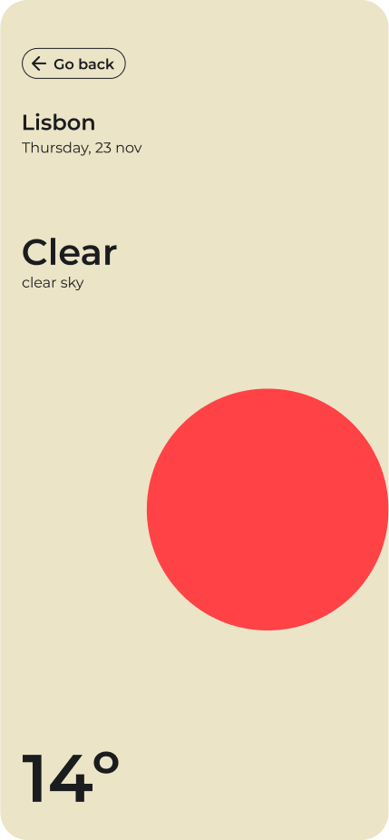
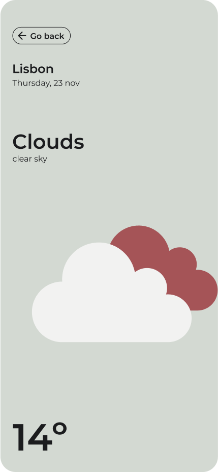
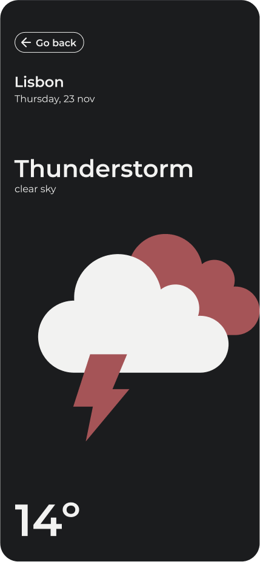
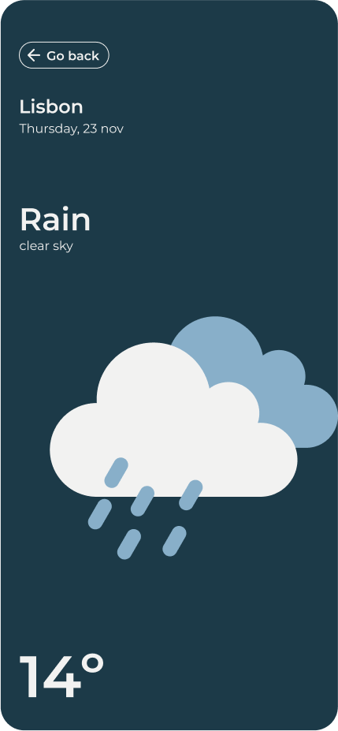
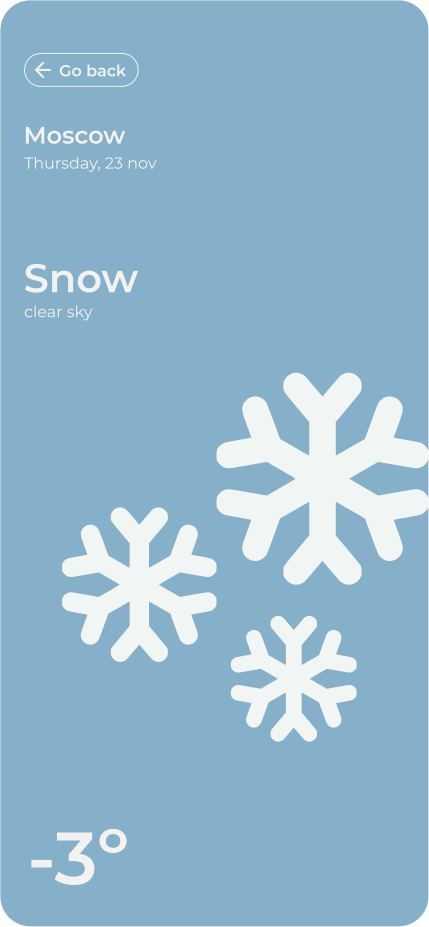

# React Native How is the weather App

This is a React Native App to show information about the weather. The App use the Open Weather API service to handle this information.

- [Open Weather API](https://openweathermap.org/api) for weather

### Setup Environment

Project created with Expo based in a managed workflow method.

### Run

**Install dependencies**

```
npm install
```

**Run IOS**

```
npm run ios
```

**Run Android**

```
npm run android
```

### 🛠 Tech and Libraries

- [React Native](https://reactnative.dev/)
- [TypeScript](https://www.typescriptlang.org/)
- [React Navigation](https://reactnavigation.org/): Routing and navigation
- [FetchAPI](https://reactnative.dev/docs/network#using-fetch): Promise based HTTP API Request
- [styled-components](https://styled-components.com/) for theme and build UI

### App Screenshots

|  | |
|  |  |
|  |  |
|  |  |
